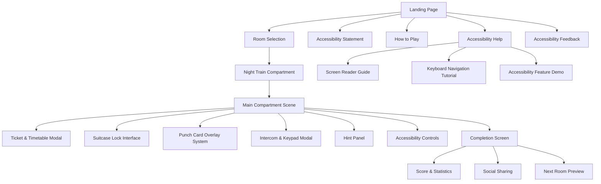
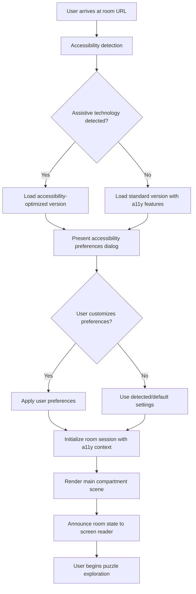
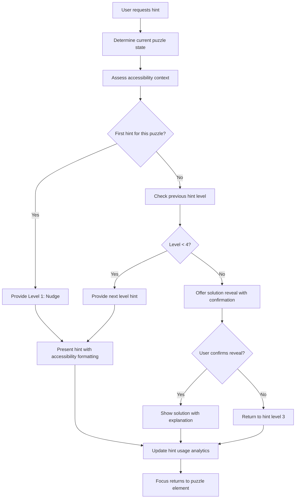
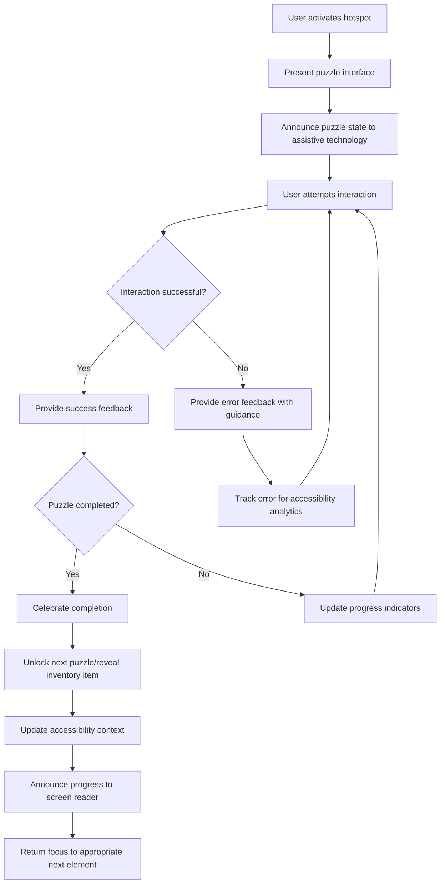

# BMad Escape Room - Night Train Experience UI/UX Specification

## Introduction

This document defines the user experience goals, information architecture, user flows, and visual design specifications for BMad Escape Room - Night Train Experience's user interface. It serves as the foundation for visual design and frontend development, ensuring a cohesive and user-centered experience.

### Overall UX Goals & Principles

#### Target User Personas

**Accessibility Champion:** Tech-savvy professionals and advocates who prioritize inclusive design and serve as influencers within disability communities. They expect exceptional accessibility implementation and will evangelize or criticize based on actual usability with assistive technologies.

**Corporate Training Manager:** HR/L&D professionals responsible for team engagement and compliance. They need scalable, accessible solutions that demonstrate organizational commitment to inclusion while providing measurable team-building value.

**Puzzle Enthusiast with Accessibility Needs:** Individual users who love mental challenges but have been excluded from traditional escape room experiences. They seek engaging, challenging content that doesn't compromise on accessibility or patronize their capabilities.

**Casual User Seeking Inclusive Entertainment:** General audience members who appreciate thoughtfully designed experiences and may share accessible content with friends/family who have accessibility needs.

#### Usability Goals

- **Immediate Accessibility Detection:** System detects and adapts to user's assistive technology within 3 seconds of page load
- **Zero Accessibility Friction:** Users with screen readers or keyboard-only navigation can complete puzzles as efficiently as mouse users
- **5-Minute Challenge Completion:** Target completion time maintains engagement without time pressure stress for users who need longer processing time
- **Progressive Assistance Effectiveness:** 85% of users who request hints successfully complete puzzles without frustration
- **Cross-Input Method Consistency:** All interactions work identically across mouse, keyboard, touch, and screen reader navigation

#### Design Principles

1. **Accessibility Without Compromise** - Every design decision prioritizes universal access while maintaining visual elegance and challenge integrity
2. **Progressive Enhancement & Graceful Degradation** - Core functionality works without JavaScript; enhanced features layer on top without breaking basic experience
3. **Clarity Through Structure** - Visual hierarchy, semantic HTML, and logical flow support both sighted users and screen readers
4. **Tactile Digital Metaphors** - Virtual interactions feel satisfying and intuitive across all input methods, mimicking real-world object manipulation
5. **Inclusive Feedback Systems** - Visual, auditory, and haptic feedback ensure all users receive confirmation of their actions and progress

### Change Log

| Date | Version | Description | Author |
|------|---------|-------------|---------|
| 2024-01-XX | v1.0 | Initial UI/UX specification for accessibility-first escape room | BMad UX Expert |

## Information Architecture (IA)

### Site Map / Screen Inventory

### Navigation Structure

**Primary Navigation:** Skip links for screen readers, main room interface with clearly labeled hotspots, persistent accessibility controls, and hint access button always visible in top navigation bar.

**Secondary Navigation:** Within-modal navigation using Tab order and arrow keys, breadcrumb-style progress indicators showing puzzle completion status, contextual help that adapts to current interaction state.

**Breadcrumb Strategy:** Semantic progression tracking (Scene → Puzzle → Step) with ARIA landmarks, visual progress indicators that work in high contrast mode, and screen reader announcements for each stage transition.

## User Flows

### Accessibility-First Room Entry Flow

**User Goal:** Enter and begin the Night Train Compartment experience with optimal accessibility setup

**Entry Points:** Landing page link, direct room URL, returning user bookmark

**Success Criteria:** User reaches main compartment scene with all accessibility preferences applied and screen reader properly announcing room state

#### Flow Diagram

#### Edge Cases & Error Handling:
- Accessibility detection fails: Default to highest accessibility support level
- Screen reader not responding: Provide visual accessibility status indicators
- JavaScript disabled: Core hotspot inspection works with semantic HTML
- Slow connection: Progressive loading with accessibility content prioritized
- User changes assistive technology mid-session: Real-time re-detection and adaptation

**Notes:** This flow emphasizes immediate accessibility setup to prevent users from encountering barriers after beginning the experience.

### Progressive Hint Request Flow

**User Goal:** Get assistance for a specific puzzle without losing sense of achievement

**Entry Points:** Hint button always visible, inactivity trigger (45 seconds), user request via keyboard shortcut

**Success Criteria:** User receives appropriate level of assistance and can continue puzzle solving

#### Flow Diagram

#### Edge Cases & Error Handling:
- Hint request during transition: Queue request for next stable state
- Screen reader not announcing hint: Provide visual hint indicator + focus management
- User accidentally requests reveal: Clear confirmation dialog with undo option
- Hint content loading fails: Provide offline fallback hints
- Multiple rapid hint requests: Debounce with clear feedback

**Notes:** Hint system maintains user agency while providing safety net for accessibility users who may need different types of assistance.

### Complete Puzzle Interaction Flow

**User Goal:** Solve individual puzzles using preferred interaction method while receiving appropriate feedback

**Entry Points:** Hotspot activation via click, keyboard, or screen reader navigation

**Success Criteria:** User successfully completes puzzle with clear confirmation and advancement to next challenge

#### Flow Diagram

#### Edge Cases & Error Handling:
- Drag operation fails on touch device: Provide tap-to-select alternative
- User loses focus during modal interaction: Return focus to trigger element
- Animation causes motion sensitivity issues: Provide reduced motion alternative
- Audio cues not available: Provide visual and haptic alternatives
- Progress lost due to connection issue: Restore state from localStorage

**Notes:** Each puzzle interaction maintains contextual awareness of user's accessibility needs and preferred interaction methods.

## Wireframes & Mockups

### Design Files

**Primary Design Files:** Figma workspace with accessibility annotations and interaction prototypes: [Design System Link]

### Key Screen Layouts

#### Main Compartment Scene

**Purpose:** Primary game interface displaying the train compartment with interactive hotspots and accessibility controls

**Key Elements:**
- Central compartment illustration with blueprint aesthetic
- Five labeled hotspots: Ticket & Timetable, Suitcase, Intercom, Door Keypad, Window
- Persistent accessibility toolbar with contrast, font size, and motion controls
- Timer display (optional/hideable for accessibility users)
- Hint button with progressive level indicator
- Inventory panel for collected items
- Skip links for screen reader navigation

**Interaction Notes:** All hotspots provide hover states, keyboard focus indicators, and screen reader descriptions. Generous click targets (minimum 44px) with extended interaction zones for motor accessibility.

**Design File Reference:** Main Scene - Accessibility Variants Artboard

#### Accessibility Preferences Modal

**Purpose:** Comprehensive accessibility customization interface that appears on first visit or via settings menu

**Key Elements:**
- Screen reader optimization toggle with explanation
- Keyboard navigation mode with visual focus enhancement
- High contrast mode with preview
- Motion reduction settings with animation examples
- Font size adjustment slider with live preview
- Dyslexia-friendly font option
- Audio description preferences
- Color customization for colorblind users

**Interaction Notes:** Modal uses focus trap, announces changes to screen readers, and provides undo functionality. All changes applied immediately with clear feedback.

**Design File Reference:** A11y Preferences Modal - States & Interactions

#### Progressive Hint Panel

**Purpose:** Sliding panel that provides four levels of assistance while maintaining puzzle challenge integrity

**Key Elements:**
- Hint level indicator (1-4) with descriptive labels
- Hint content area with accessibility formatting
- "More specific" and "Reveal solution" buttons
- Hint effectiveness rating (optional feedback)
- Return to puzzle button with proper focus management
- Visual penalty indicator for scoring systems

**Interaction Notes:** Panel slides from right side, maintains focus within panel, provides clear exit mechanisms, and formats hint content for optimal screen reader experience.

**Design File Reference:** Hint System - Progressive Levels & Accessibility

#### Suitcase Lock Interface

**Purpose:** Digital combination lock interface optimized for multiple input methods

**Key Elements:**
- Three large, clearly labeled number dials or input fields
- Visual feedback for each digit entry
- Submit/unlock button with loading state
- Error messaging with specific guidance
- Alternative input method (number pad for screen readers)
- Clear reset functionality

**Interaction Notes:** Supports click, keyboard arrow keys, and direct number entry. Provides audio feedback for dial rotation and clear success/error states.

**Design File Reference:** Suitcase Lock - Input Method Variants

#### Punch Card Overlay System

**Purpose:** Drag-and-drop interface with accessibility alternatives for overlay alignment puzzle

**Key Elements:**
- Timetable board with grid alignment guides
- Draggable punch card overlay with handle indicators
- Snap zones with visual and audio feedback
- Letter revelation area showing discovered characters
- Keyboard alternative (directional controls + snap)
- Reset to original position button

**Interaction Notes:** Generous snap zones, clear drag state indicators, keyboard navigation with arrow keys and space to drop, screen reader announces letter discoveries.

**Design File Reference:** Punch Card System - Interaction States

## Component Library / Design System

### Design System Approach

**Custom Accessibility-First Design System** built on Headless UI and Radix UI primitives, ensuring WCAG 2.1 AA compliance at the component level. System emphasizes semantic structure, keyboard navigation patterns, and screen reader compatibility over visual innovation.

### Core Components

#### AccessibleButton

**Purpose:** Primary interaction component with built-in accessibility features and consistent styling

**Variants:** Primary, Secondary, Ghost, Destructive, Icon-only

**States:** Default, Hover, Focus, Active, Disabled, Loading

**Usage Guidelines:** Always include descriptive aria-label for icon buttons, use semantic button element, provide loading states for async actions, maintain minimum 44px touch target size.

#### AccessibleModal

**Purpose:** Overlay interface component with focus trapping and accessibility announcements

**Variants:** Small, Medium, Large, Fullscreen

**States:** Opening, Open, Closing, Closed

**Usage Guidelines:** Focus trap active when open, announces modal purpose to screen readers, ESC key closes modal, focus returns to trigger element on close.

#### ProgressiveHint

**Purpose:** Specialized component for delivering tiered assistance with accessibility formatting

**Variants:** Nudge, Hint, Specific, Reveal

**States:** Collapsed, Expanded, Loading, Error

**Usage Guidelines:** Content formatted for screen readers, maintains reading flow, provides clear level progression, includes effectiveness feedback mechanisms.

#### HotspotIndicator

**Purpose:** Interactive area markers with multiple interaction methods and clear affordances

**Variants:** Available, Active, Completed, Locked

**States:** Default, Hover, Focus, Pressed, Loading

**Usage Guidelines:** Minimum 44px interaction area, descriptive labels, keyboard accessible, provides interaction hints for different input methods.

#### AccessibilityToolbar

**Purpose:** Persistent accessibility control panel with user preference management

**Variants:** Compact, Expanded, Mobile

**States:** Hidden, Visible, Expanded

**Usage Guidelines:** Always accessible via keyboard shortcut, preferences persist across sessions, provides immediate visual feedback for changes.

## Branding & Style Guide

### Visual Identity

**Brand Guidelines:** Blueprint-inspired design language that evokes technical precision while maintaining warmth and approachability. Visual metaphors drawn from vintage train travel and architectural drawings.

### Color Palette

| Color Type | Hex Code | Usage |
|------------|----------|-------|
| Primary | #1e293b (Slate 800) | Main backgrounds, primary text, key UI elements |
| Secondary | #fef7ed (Orange 50) | Light backgrounds, subtle highlights, content areas |
| Accent | #d4af37 (Gold) | Interactive elements, success states, brass details |
| Success | #10b981 (Emerald 500) | Positive feedback, puzzle completion, progress indicators |
| Warning | #f59e0b (Amber 500) | Cautions, hint usage indicators, attention states |
| Error | #ef4444 (Red 500) | Errors, incorrect attempts, destructive actions |
| Neutral | #64748b - #f8fafc | Text hierarchy, borders, subtle backgrounds |

### Typography

#### Font Families

- **Primary:** Inter (high legibility, excellent accessibility)
- **Secondary:** JetBrains Mono (code elements, puzzle text)
- **Accessibility Alternative:** OpenDyslexic (optional user selection)

#### Type Scale

| Element | Size | Weight | Line Height |
|---------|------|--------|-------------|
| H1 | 2.25rem (36px) | 700 | 1.2 |
| H2 | 1.875rem (30px) | 600 | 1.3 |
| H3 | 1.5rem (24px) | 600 | 1.4 |
| Body | 1rem (16px) | 400 | 1.6 |
| Small | 0.875rem (14px) | 400 | 1.5 |

### Iconography

**Icon Library:** Lucide React icons with custom accessibility-specific icons for specialized features

**Usage Guidelines:** All icons paired with descriptive text or aria-labels, minimum 16px size for readability, consistent stroke weight (2px), scalable vector format for crisp display at all sizes.

### Spacing & Layout

**Grid System:** 8px base unit grid system with 12-column responsive layout

**Spacing Scale:** 0.25rem, 0.5rem, 0.75rem, 1rem, 1.5rem, 2rem, 3rem, 4rem, 6rem, 8rem based on 8px increments

## Accessibility Requirements

### Compliance Target

**Standard:** WCAG 2.1 AA compliance with selected AAA features for critical interactions

### Key Requirements

**Visual:**
- Color contrast ratios: 4.5:1 minimum for normal text, 3:1 for large text, 7:1 for critical UI elements
- Focus indicators: 2px solid outline with sufficient contrast, visible on all interactive elements
- Text sizing: Scalable up to 200% without horizontal scrolling, dyslexia-friendly font options

**Interaction:**
- Keyboard navigation: Full functionality available via keyboard, logical tab order, skip links provided
- Screen reader support: Semantic HTML structure, ARIA labels and descriptions, live region announcements
- Touch targets: Minimum 44px tap targets, adequate spacing between interactive elements

**Content:**
- Alternative text: Descriptive alt text for all meaningful images, empty alt for decorative elements
- Heading structure: Logical heading hierarchy (h1-h6), no skipped levels, clear content organization
- Form labels: Visible labels for all form controls, error messages associated with relevant fields

### Testing Strategy

Multi-layer accessibility validation including automated axe-core testing in CI/CD pipeline, manual testing with real screen readers (NVDA, JAWS, VoiceOver), keyboard-only navigation testing, and user testing with accessibility community members.

## Responsiveness Strategy

### Breakpoints

| Breakpoint | Min Width | Max Width | Target Devices |
|------------|-----------|-----------|----------------|
| Mobile | 0px | 767px | Mobile phones, small tablets in portrait |
| Tablet | 768px | 1023px | Tablets, small laptops |
| Desktop | 1024px | 1439px | Standard laptops, desktop monitors |
| Wide | 1440px | - | Large monitors, ultrawide displays |

### Adaptation Patterns

**Layout Changes:** Single-column mobile layout with stacked hotspots, tablet maintains compartment view with reorganized controls, desktop provides optimal spacing and peripheral accessibility tools.

**Navigation Changes:** Mobile uses bottom navigation bar with larger touch targets, tablet provides side-mounted accessibility controls, desktop maintains persistent accessibility toolbar.

**Content Priority:** Mobile prioritizes current puzzle focus with collapsible secondary elements, tablet balances overview and detail, desktop provides full context view.

**Interaction Changes:** Mobile uses tap and long-press patterns, tablet supports both touch and keyboard, desktop optimizes for mouse and keyboard with touch support.

## Animation & Micro-interactions

### Motion Principles

**Purposeful Animation:** Every animation serves accessibility or usability purpose - focus transitions, state changes, and progress feedback. **Respectful Motion:** All animations respect prefers-reduced-motion settings with instant alternatives. **Clear Hierarchy:** Motion guides attention to important changes without overwhelming users. **Performance Conscious:** Animations optimized for screen reader performance and low-end devices.

### Key Animations

- **Focus Transition:** Smooth focus ring animation when navigating with keyboard (200ms, ease-out)
- **Modal Open/Close:** Gentle scale and fade with focus management (250ms, ease-in-out)
- **Hint Panel Slide:** Right-to-left slide with content fade-in (300ms, ease-out)
- **Success State:** Satisfying completion animation with accessibility announcements (400ms, bounce)
- **Error Shake:** Subtle shake for incorrect inputs with clear recovery path (200ms, ease-in-out)
- **Progress Indicators:** Smooth progress bar fills with screen reader updates (varies, linear)
- **Hotspot Pulse:** Gentle attention-drawing pulse for guidance system (1000ms, infinite, ease-in-out)

## Performance Considerations

### Performance Goals

- **Page Load:** <3 seconds for initial content, <1 second for accessibility feature activation
- **Interaction Response:** <100ms for immediate feedback, <500ms for complex state changes
- **Animation FPS:** Consistent 60fps with graceful degradation to instant states when needed

### Design Strategies

**Accessibility-First Performance:** Prioritize loading of semantic content and accessibility features over visual enhancements. **Progressive Enhancement:** Core functionality loads first, enhanced interactions layer on without blocking. **Efficient Focus Management:** Minimize DOM queries for focus transitions, cache frequently accessed elements. **Optimized Screen Reader Experience:** Structure content for efficient screen reader navigation, minimize unnecessary announcements.

## Next Steps

### Immediate Actions

1. **Stakeholder Review:** Present specification to accessibility advocates and corporate training team for validation
2. **Technical Architecture Alignment:** Coordinate with Winston's technical architecture to ensure feasibility
3. **Design System Development:** Begin building accessible component library in Figma with interaction specifications
4. **User Testing Plan:** Recruit accessibility community members for early design validation sessions
5. **Development Handoff:** Prepare detailed component specifications and interaction patterns for frontend implementation

### Design Handoff Checklist

- [x] All user flows documented with accessibility considerations
- [x] Component inventory complete with accessibility states
- [x] Accessibility requirements defined at WCAG 2.1 AA level
- [x] Responsive strategy clear across all device categories
- [x] Brand guidelines incorporated with contrast validation
- [x] Performance goals established with accessibility priorities

---

🎨 **UX Specification Complete!** This comprehensive frontend specification provides the detailed accessibility-first design foundation for implementing Winston's technical architecture. The specification emphasizes:

- **Universal Design Principles** that serve all users excellently rather than segregating accessibility features
- **Progressive Enhancement Strategy** ensuring core functionality works across all capabilities and devices
- **Clear Implementation Guidance** with specific component specifications and interaction patterns
- **Performance-Conscious Accessibility** balancing rich interactions with assistive technology compatibility

The design system and component specifications are ready for frontend development, with detailed accessibility requirements that align perfectly with the T3 Stack architecture and tRPC implementation Winston designed.
